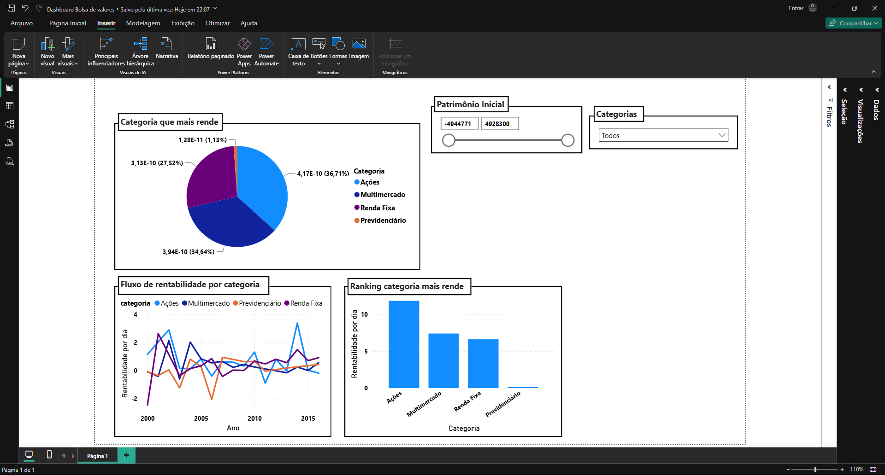

# Bolsa de valores

Este projeto apresenta um pipeline robusto de **Engenharia de Dados (ETL)** e **Análise Exploratória**, focado na higienização de ativos financeiros, **tratamento estatístico** de anomalias e **visualização de KPIs** para suporte à decisão. O dashboard integrado oferece uma visão 360º da performance, incluindo análise de rentabilidade por categoria, tendências de fluxo de rendimento ao longo do tempo e o ranking de eficiência mensal dos fundos.

# 🛠 Tecnologias Utilizadas

- **Linguagem**: **Python**

- **Bibliotecas:** **Pandas**, **NumPy**, **SciPy**

- **Ferramenta de BI:** Power BI

- **Técnicas:** ETL, Z-Score, IQR, Correlação de Spearman, Modelagem Relacional

# ⚙️ Processo de Pipeline (ETL)

O **fluxo de dados** foi construído para garantir integridade e qualidade analítica:

- **Limpeza Granular:** Processamento individual de tabelas e colunas, com padronização de tipos (conversão de datas e numéricos), tratamento de valores nulos e correções de formatação.

- Integridade Referencial: Utilização de **merge** e **filtros**, **.isin** para validar IDs de fundos e garantir que apenas dados consistentes fossem integrados ao modelo final.

- **Segurança e Conformidade:** Aplicação de diretrizes alinhadas à **LGPD** durante a manipulação de dados sensíveis.

# 📊 Análise Estatística e Auditoria

Para garantir a robustez da análise, dividi o tratamento estatístico conforme a natureza dos dados:

- **Z-Score (Patrimônio Inicial):** Aplicado à distribuição linear do patrimônio para identificar e rankear fundos com comportamento atípico (outliers positivos).

- **IQR - Intervalo Interquartil (Cotação):** Utilizado para identificar e tratar volatilidade extrema em dados não lineares, garantindo que valores "absurdos" não enviesassem a análise de performance.

- **Correlação de Spearman:** Calculada entre a rentabilidade diária e a cotação. O resultado de 0.038 confirmou a ausência de correlação linear significativa, demonstrando a independência das variáveis e a necessidade de análises multivariadas.

# 📈 Insights do Dashboard

O Dashboard no **Power BI** foi estruturado para fornecer uma visão 360º dos ativos:

- **Distribuição por Categoria:** Gráfico de pizza para visualizar a concentração de rentabilidade.

- **Análise Temporal:** Gráfico de linhas para identificar a confiabilidade das categorias no curto e longo prazo.

- **Eficiência e Performance:** Gráfico de colunas para comparar a rentabilidade percentual real de cada categoria.

# 💡 Propostas de Melhoria para a Empresa

Com base nos dados analisados, as seguintes melhorias estratégicas foram identificadas:

- **Monitoramento de Outliers:** Implementação do ranking de auditoria gerado no script como um alerta para o time de gestão, facilitando a identificação de fundos com crescimento anômalo.

- **Otimização de Portfólio:** Utilização da medida de "Eficiência de Capital" (Rentabilidade/Patrimônio) para identificar categorias que entregam melhores retornos com menor aporte inicial.

- **Refinamento do Pipeline:** Automação dos scripts via logging e try/except para garantir que a carga de dados diária seja resiliente e auto-auditável.

### 📝 Autor

**Andrei - Analista de Dados / Desenvolvedor**